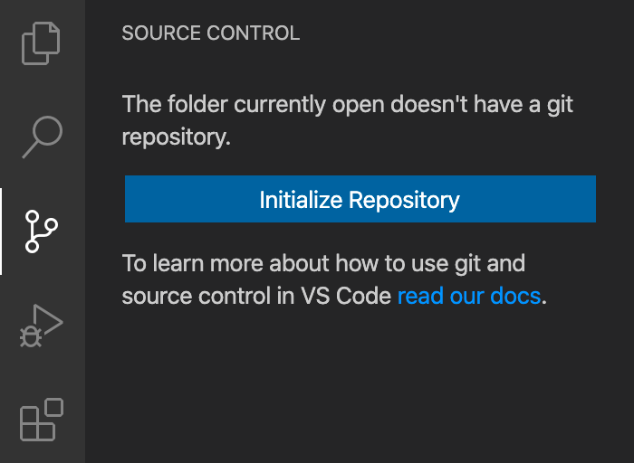
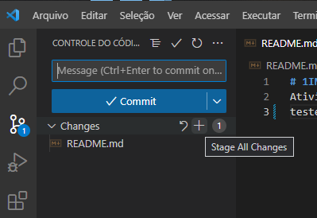
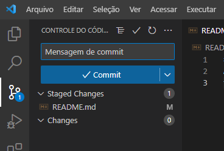
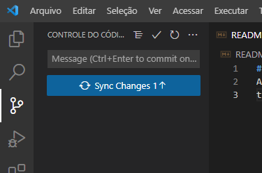

# 1INFO1 - Estrutura de Repetição

_ANTES DE COMEÇAR A PROVA, VERIFIQUE SE VOCÊ DEVERÁ FAZER A **PROVA A** OU A **PROVA B**._

Para clonar o repositório, copie o link do repositório, que segue abaixo, para clonar usando o atalho _**Ctrl + Shift + P**_ e digitando _**"Clonar"**_. Após, cole o seguinte texto:
```git
https://github.com/ldmfabio/1INFO1_estRepeticao.git
```

Ou, então, no terminal do VSCode, digite o seguinte comando
```git
git clone https://github.com/ldmfabio/1INFO1_estRepeticao.git
```

## Comandos para serem executados no VSCode

### Remover ligação com o repositório original (ou seja, desvincular do repositório do Professor Fábio)
```git
git remote rm origin
```

### Configurar usuário do GitHub no VSCode
```git
git config user.name "Coloque o seu nome entre as aspas"
```

### Configurar e-mail do GitHub no VSCode
```git
git config user.email "Coloque o seu e-mail entre as aspas"
```

### Mais algumas coisas
- Não esqueça de logar com sua conta do GitHub no VSCode
- Vá na guia onde você utiliza para enviar os arquivos para o GitHub e crie o **SEU** repositório do GitHub pelo próprio VSCode
  - Para tal, você poderá pressionar as teclas **_Ctrl + Shift + G_**;
    - **OU**, clique na figura demonstrada abaixo.
  
  - Após, inicialize o seu repositório do GitHub, colocando o nome como _**"estRepeticaoProvaA"**_ ou _**"estRepeticaoProvaB"**_.
  - Para voltar aos arquivos, clique na primeira opção da barra de atividades, ou, então, pressione as teclas **_Ctrl + Shift + E_**.

### Enviar arquivos para o repositório do GitHub

Mesmo iniciando o repositório do GitHub, os arquivos ainda não estarão na plataforma. 

Portanto, volte na terceira opção da barra de atividades (ou pressione as teclas **_Ctrl + Shift + G_**) e publique a Branch (ou _Filial_, depende de como estará o idioma do seu VSCode).

&nbsp;
&nbsp;

### **Via comandos no terminal do VSCode**
Caso queira executar os comandos via terminal, após você finalizar a prova (e já ter criado o repositório no GitHub), a sequência é:

- Informar que os arquivos alterados serão enviados para o GitHUb
    > _git add ._
- Definir mensagem de commit
    > _git commit -m "Coloque sua mensagem aqui"_
- Enviar arquivos (push)
    > _git push_

&nbsp;
&nbsp;

### **Via interface visual do VSCode**
Ou, se for fazer via interface visual, a sequência de cliques é:
- Adicionar alterações


- Adicionar mensagem de commit e, então clicar em **_Commit_**


- Sincronizar as alterações com o repositório remoto




## **FINALIZANDO!**

&nbsp;
_Não esqueça de postar o link do seu repositório GitHub na respectiva atividade da atividade avaliativa, que foi colocada no Classroom._

&nbsp;
&nbsp;
_Caso o seu repositório seja privado/private (inclusive recomendo que seja), é preciso colocar o usuário **LDMFABIO** como colaborador do repositório._


# **UMA BOA AVALIAÇÃO A TODOS!**